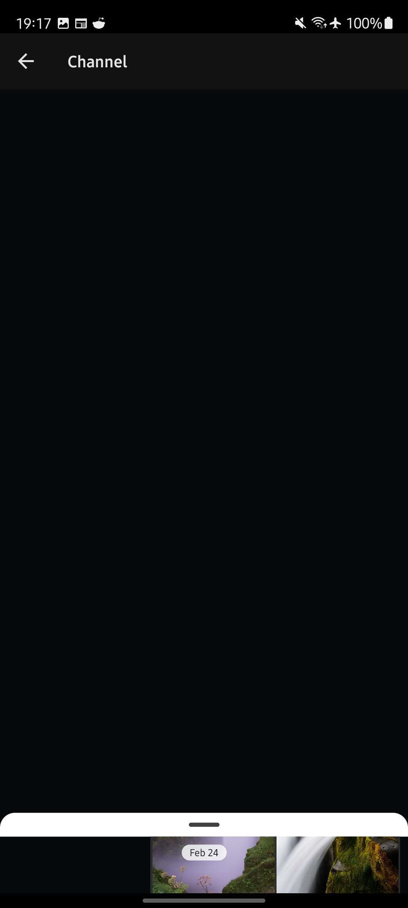
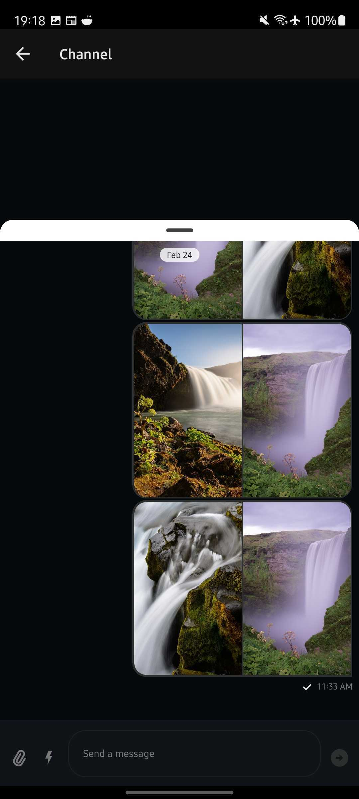
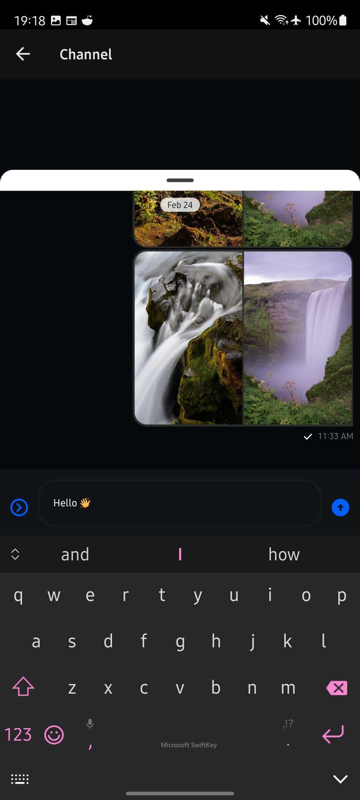

<h1 align="center">Stream Chat React Native in a BottomSheet</h1>

> A basic chat application using Stream Chat React Native inside a bottom sheet

<table>
  <tr>
    <td>
       
    </td> 
    <td>
       
    </td> 
    <td>
       
    </td> 
  </tr>
</table>

## Install

Your Stream chat API key and API secret as well as a user ID and user token need to exist either in your $PATH or in `/<app-directory>/.env`. See [.env.example](./.env.example).

```sh
yarn install && npx pod-install
```

## Usage

```sh
yarn run ios
```

```sh
yarn run android
```

## Run tests

```sh
yarn run test
```
